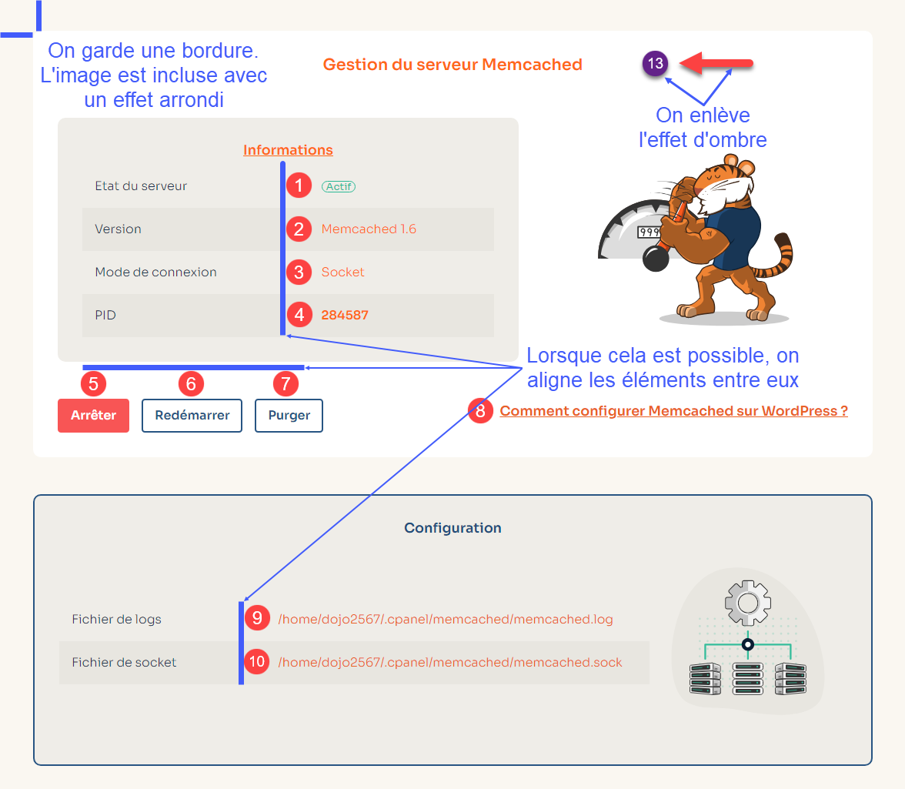

# Documentation o2switch

La nouvelle version de la documentation o2switch est construite avec [Docusaurus](https://docusaurus.io/), un 
générateur de site statique moderne.


## Comment lancer le projet ?

Dans un premier temps, il faut installer une version récente de [NodeJS](https://nodejs.org/fr/download/package-manager).

Ensuite, pour lancer l'environnement de développement du projet, il suffit de cloner le dépôt GIT, d'installer
les dépendances du projet avec `npm install` puis de lancer `npm start` : 

```bash
git clone git@github.com:xxxxxxx/documentation.git
npm install
npm start
```

Cela lancera le serveur web inclus à NodeJS sur l'adresse `http://localhost:3000`.

On peut ensuite modifier le projet, la page `http://localhost:3000` se rafraichira automatiquement et en direct. 

Après avoir effectué une modification sur le projet, avant de publier cela, il est recommandé de lancer `npm run build`. 
Cela forcera la création d'un build et cela permet de vérifier que les modifications réalisées n'introduisent pas 
d'erreurs (par exemple, des liens cassés / des IDs de pages en double). La phase de build détecte des erreurs qui 
passent parfois inaperçues avec le mode de développement. 

## Quelques règles pour participer

Afin de garder la documentation cohérente et maintenable, il est nécessaire de mettre en place quelques règles.

### Organisation du dossier static

Pour éviter d'avoir un dossier `/static` désorganisé et avec des centaines de fichiers à la racine, les images 
d'illustrations doivent être organisées en suivant la même structure que les pages `docs`.

Par exemple, si la page `docs/cpanel/ma-categorie/mon-outil.md` a besoin d'une illustration ou capture d'écran, 
il faudra la placer dans `static/img/docs/cpanel/ma-categorie/`.  On s'arrête au niveau de la catégorie, il n'est pas
nécessaire de recréer un dossier avec le nom de l'outil.

Les exceptions concernent les images qui peuvent être réutilisées sur plusieurs pages, comme les différentes 
illustrations de la mascotte o2switch. Pour ces images-là, on peut créer un dossier dans `/static/img` directement.

### Captures d'écrans et illustrations

Pour les captures d'écrans, il faut essayer de rester cohérent avec le reste de la documentation et les rendre le
plus lisible possible. 

Quelques règles à suivre : 
  * Ne prenez pas une capture d'écran de la page entière si cela n'est pas nécessaire. Par exemple, dans cPanel, le
  menu à gauche peut être exclus des captures, ça n'apporte rien de plus.
  * À l'inverse, ne prenez pas une capture d'écran qui soit trop zoomé. Prenez une capture d'écran plus globale, afin
  de garder le contexte et que l'utilisateur puisse se repérer plus facilement. Si besoin, mettez en avant ce que vous
  souhaitez en utilisant des flèches / rectangles de couleurs.
  * N'hésitez pas à utiliser les bulles d'étapes (cercles de couleurs avec 1, 2, 3 etc...) dans les captures d'écrans 
  pour annoter les étapes d'une procédure et guider l'utilisateur au mieux.
  * Si plusieurs captures d'écrans se suivent dans une page et que ces captures d'écrans ont des bulles d'étapes, alors
  essayer de varier les couleurs dans les bulles d'aides ou de varier en utilisant des lettres. Exemple, la capture 1
  du tutoriel va contenir des bulles d'étapes 1, 2, 3 avec un fond rouge. La capture 2 qui suit va contenir des bulles 
  1, 2, 3 avec un fond vert. Ainsi, dans le texte de la documentation, on peut réutiliser le même code couleur et éviter
  que l'utilisateur lise la documentation en regardant la mauvaise capture d'écrans d'illustration.  
  * Essayez de faire des belles captures d'écrans, qui s'intègrent bien dans le thème clair et le thème sombre de la
  documentation. Par exemple, pour les différents outils cPanel, on peut garder la bordure de fond autour des captures
  d'écrans, ça s'intègre bien.
  * Si vous faites une illustration / schéma, pensez au deux modes. L'illustration doit être lisible sur fond clair
  et sombre. 
  * Nommez vos images, pensez à utiliser des mots clés pour le référencement / pour s'y retrouver plus facilement
  * Utilisez le composant pour inclure les images en notant bien les champs Alt, Title et Caption. Le champs Alt peut 
  être utilisé pour décrire l'image (pensez à un lecteur d'écran), le Title correspondra à ce qui s'affichera en 
  survolant la souris sur l'image. Et le Caption correspond à la petite phrase explicative qui se situe en dessous
  de l'image.

Si vous avez un doute, regardez les autres pages et prenez exemple sur la manière dont cela est fait. 

Exemple d'intégration : 

```mdx
<Image
    src="/img/docs/cpanel/bases-de-donnees/creer-base-donnees-mysql.png"
    title="Formulaire de création d'une base de données dans cPanel"
    caption="Formulaire de création d'une base de données MySQL"
    alt="Capture d'écran du formulaire de création d'une base de données MySQL"
/>
```

Pour les bulles d'aides, on peut utiliser les badges dans le texte écrit pour faire référence à une bulle d'étape
précise de la capture d'écran. 

```mdx 
<span className="badge badge--danger">1</span> 
<span className="badge badge--danger">2</span>
<span className="badge badge--danger">3</span>  

<span className="badge badge--warning">1</span> 

<span className="badge badge--success">1</span> 
```

Pour les captures d'écrans, on peut utiliser le logiciel [Snagit](https://www.techsmith.fr/snagit/). Pour rester
cohérent, sur les effets de flèches, rectangles et bulles d'étapes, il faut : 
  * enlever les effets d'ombres 
  * garder les mêmes couleurs, on reprend les couleurs par défaut du logiciel, celle proposée de base 
  * on n'abuse pas des effets en surchargeant l'image
  * si on encadre un bouton, on essaye de le faire le plus proprement possible en entourant bien le bouton / éléments 
  * on aligne au mieux les éléments d'annotation que l'on ajoute. Exemple : on annote un formulaire vertical avec des
  bulles d'étapes, on aligne les bulles d'étapes qu'on ajoute plutôt que de les disperser dans la capture 
  * si on utilise des flèches, on essaye de faire en sorte de ne pas les faire croiser entre elles 
  * si on ajoute du texte, on s'assure qu'il reste lisible par rapport au fond de l'image 
  * si on ajoute des annotations/éléments, on s'assure que ce qu'on ajoute ne masque pas une partie importante de la
  capture d'écran 

Ci-dessous une capture d'écran issue d'un des guides, annotée en bleu.


### Longueur des lignes 

Une ligne dans un document doit faire 120 caractères au maximum. Si cela dépasse 120 caractères, faites un saut de 
ligne pour conserver la lisibilité.

Faites cela lorsque c'est techniquement possible. Configurez votre IDE pour inclure une barre visuelle (`editor.rulers`
dans vscode).

### Référencement / SEO

Pour chaque page, il faut impérativement utiliser l'entête [front matter](https://docusaurus.io/fr/docs/next/markdown-features#front-matter).

Exemple d'entête à utiliser : 

```mdx
---
title: Base de données MySQL
sidebar_label: Base de données MySQL
description: L'outil base de donnée MySQL permet de créer des bases de données MySQL, des utilisateurs MySQL et gérer les droits des utilisateurs sur les bases
image: /img/docs/tools/mysql_databases.png
tags:
  - cpanel
  - hébergement mutualisé
  - offre unique
  - offre scale'up
  - mysql
  - mariadb
  - bases de données
---
```

Idéalement le titre doit faire moins de 60 caractères, la description entre 150-160 caractères. L'image est normalisée,
lire la partie suivante pour comprendre.

Les tags sont présents pour la recherche plutôt que le SEO.

### Documentation des pages d'outils 

Pour la documentation des pages d'outils dans cPanel, il y a une certaine structure en place pour unifier cela. Une
page de documentation d'un outil est structuré ainsi : 

```mdx
---
title: Titre de la page (<= 60 caractères)
sidebar_label: Nom de l'outil (qui s'affiche dans la Sidebar)
description: La description pour le SEO (150-160 caractères)
image: /img/docs/tools/nom_outils.png
tags:
  - tag1
  - tag2
  - tag3....
---

# Titre de la page

Petite description de l'outil en quelques lignes 

<PreviewToolCard tool='nom_outils' />

## Sous titre
```

`<PreviewToolCard tool='nom_outils' />` est un composant qui permet d'afficher la capture d'écran globale de l'outil
en page d'accueil. La capture d'écran doit être de l'outil, assez grande et montrer rapidement à quoi ressemble
l'outil.

Pour chaque outil, il faut créer un fichier dans `static/img/docs/tools/nom_outil.png`. Il faut bien respecter
le nom de l'outil, qui doit correspondre à l'un des noms défini dans `src/components/_data/tools.ts`.

### Copyright

Tout le contenu de la documentation o2switch est protégé. Le contenu n'est pas libre de droit. Il est interdit de 
reprendre le contenu pour créer un autre site internet. Cela inclut les différentes images (captures d'écrans) et 
illustrations. 

Le code source de la documentation est partagée publiquement, afin d'autoriser n'importe qui à participer / proposer
des corrections.

En contribuant à cette documentation, vous cédez les droits d'auteurs et acceptez que le contenu soit publié en ligne.
